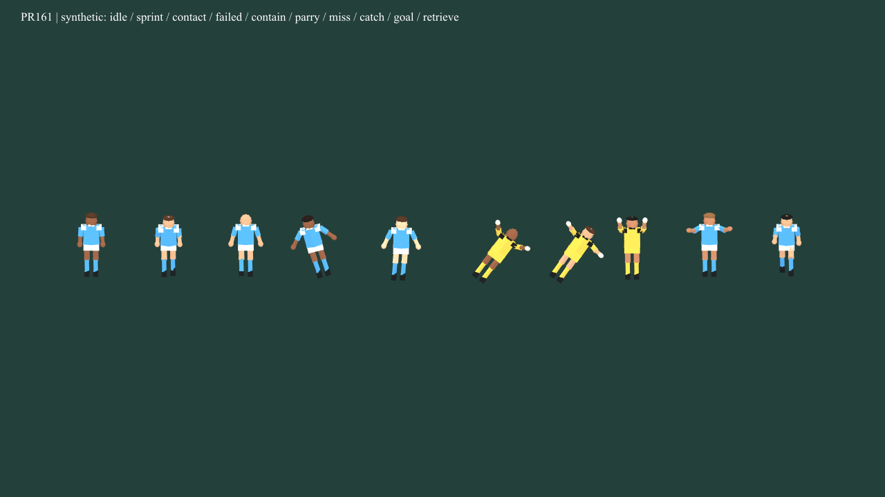
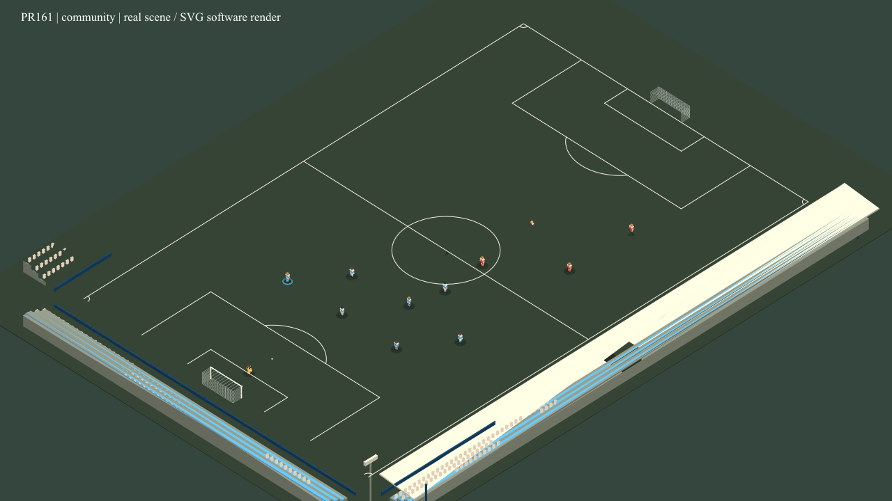
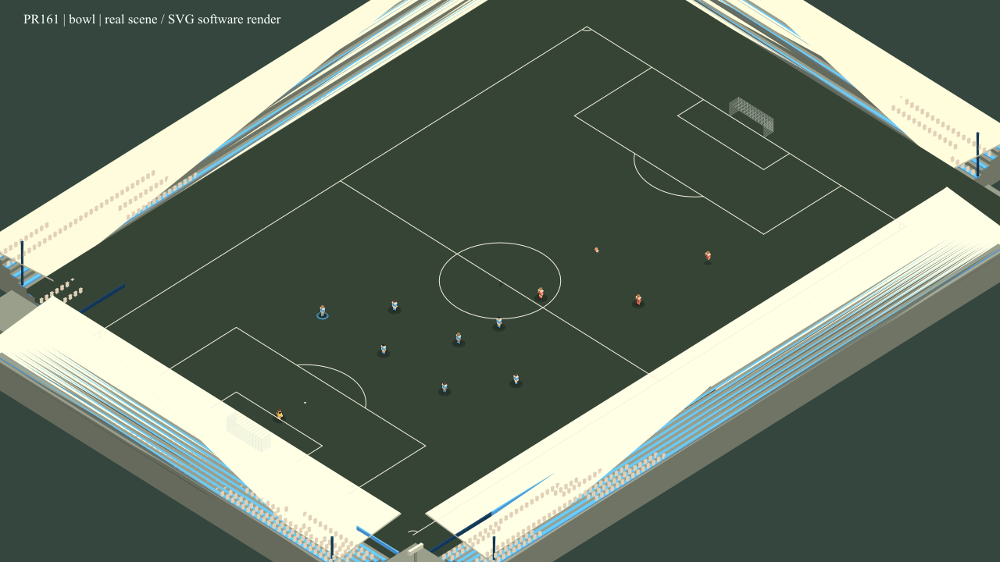
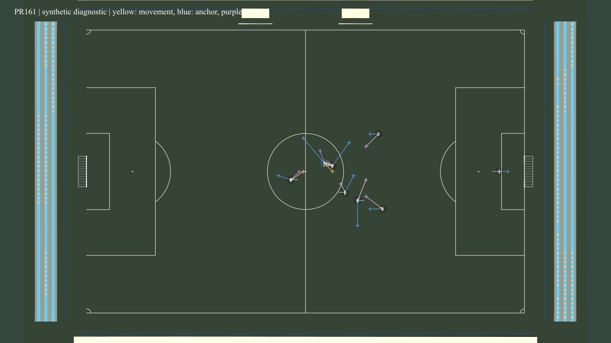

# PR161 — Match Presentation, Replay, Stadium Polish & Boundary-Ball Liveness

Base: merged PR160 / `main`, `d4b389b3db5e14e9ebc61bb1ec8bce21e3557a85`.
PR161 completes the planned presentation stage before the **Combined Match Engine
Realism & Playability Audit**. It does not tune shots, passing networks, tactics or
general action selection. The canonical step remains 0.025 s.

## Boundary-ball defect: cause, correction and evidence

The original `lab-mv2640wz-benchmark-sesji.json` was not supplied and is absent from
the repository. The retained reference seed is `lab-mv2640wz`. Evidence uses an
equivalent deterministic fixture at 439 s: stationary unowned ball centre
`(45.0816, -0.0324)`, radius 0.11 m, actual generated footballers. It does **not**
reconstruct the original XI, RNG state, preceding throw-in or full original match.

The boundary subsystem correctly considered the ball in play. Loose-ball prediction,
however, rejected its negative centre y through `pitchPointSchema`. Both assignments
and the global race were empty, so players restored formation instead of pursuing it.
The six-second baseline records zero contacts, no owner and the unchanged ball.
The nearest foot retreats from 2.2664 m to about 16 m. This is an acquisition geometry
defect, rather than evidence that the throw-in chooser failed.

Prediction now tests the **raw ball centre** against the whole-ball legal envelope,
then clamps only the player's approach intention to the existing movement bounds.
The actual ball never moves as a result. Acquisition origin and contested-contact
position use physical coordinates. Existing foot reach remains 0.82 m. Stationary
wholly-out snapshot handling chooses the boundary actually crossed by the whole ball,
including a corner where the other line is only partially overlapped. A trailing
edge exactly touching the line remains in play.

The corrected fixture physically acquires ownership at 439.775 s: 0.775 s recovery,
foot distance 0.8070489 m, ball y still -0.0324. No throw-in is fabricated. At six
seconds it has 24 finite contacts and exactly one public touch in the control episode.
The 12-cell matrix passes: legal recovery takes 0.425–1.5 s; genuine whole-crossing
cases award, physically release and return to open play after 10.725–14.675 s.

Machine traces:

- [Failing baseline](performance/PR161-boundary-baseline.json).
- [Corrected reference](performance/PR161-boundary-fixed.json).
- [12 boundary cases](performance/PR161-boundary-matrix.json).

The failed-control cell executes a real finite-contact failure before recovery.
The deflection cell starts with a synthetic recorded defender contact; it does not
claim to reconstruct a preceding live tackle. All cells require actual recovery,
contact or legal restart release/reception, rather than elapsed time alone.

`observeLooseBallLiveness` is a bounded observer: at most 1 Hz, eight representative
foot/body observations, 32 diagnostics, first report after 30 unresolved seconds
and at most one per further 30 s. It does not grant possession, relocate the ball,
change ranking, consume RNG or resolve a state after a timeout. PR160 penalty
preparation, both goal directions, keeper positioning, physical retrieval and
terminal-penalty tests remain in the regression run.

## Presentation changes and ownership

`canonicalPresentation.ts` projects shared, declarative facts for live, hidden context
and replay. It carries actual body/ball coordinates, locomotion, role, fitness,
injury, participation, recorded defensive and goalkeeper outcomes, next contact plan
and latest finite contact. Acceleration/angular velocity require adjacent observations
within 0.15 s; an observation gap leaves them absent. Staged incoming substitutes
remain distinct outside-pitch presentation bodies, never active physics participants.

The latest ground-contact observer stores one bounded fact: time, intended region,
nearest reachable executing foot, actual contact point, incoming/outgoing velocity,
impulse efficiency, retained/lost control and physical count. Executed foot is observed
from the same existing two-foot reach geometry used by the resolver, without changing
its eligibility or outcome. It can differ from an older plan after a body turn.
`regionEvidence: reachable_geometry` distinguishes this from an intended plan; it is
not an independently measured skeletal collision. A failed next plan
gets a failure time, not a fabricated executed contact. Several micro-contacts retain
one public touch. The renderer always uses the canonical ball, including between
contacts and during hand/throw preparation; it no longer attaches a legacy ball to a foot.

Articulated poses distinguish speed bands, acceleration/braking, stationary turns,
lateral/backward motion, contact preparation/execution/recovery, true shielding,
contain/engage and missed challenges. Repeated contacts during low-progress rotation
remain repeated awkward movement; there is no inferred named roulette. Keeper poses
distinguish collection height, parry, failed reach, preparation/distribution and
temporary role. Actual wall jump lift affects articulation, never the root. Subtle
fitness and injury postures use the existing two reserves/restrictions. Every model
root remains at the projected football position.

Confirmed goal-plane crossing projects the existing post-goal actor roles, urgency,
reaction interval, retrieval stage and return-to-kickoff phase in live/context/replay.
A confirmed nonurgent scorer has a restrained raised-arm reaction; the actual urgent
retriever keeps a compact running pose. Future/expired goals and unrelated actors
cannot trigger that celebration. These poses never schedule retrieval or kickoff.
Staged entrants have stored identity/position/velocity but no separately persisted
body orientation; their neutral staging facing is explicitly presentation-only.

Seven opt-in diagnostic groups separate actual position, yellow movement intention,
blue nominal anchor, purple tactical target, velocity/facing, stored assignments,
contact/ball facts and fitness/restart facts. All are off by default. The overhead
camera uses the same coordinates and stable pitch orientation. The short synthetic
diagnostic fixture explicitly labels carrier pressure/turns, pivot, passing lane and
compact recovery as a diagnostic, not tactical success. Missing persisted NPC marking,
screening or coordinated-support reasons remain unobservable; the renderer does not
rerun tactical ranking to manufacture them.

Club ID selects a stable cosmetic hash configuration: community, compact or bowl,
stand tiers/enclosure/roofs, open corners, palette, crowd density, tunnel, boards and
floodlights. Stadium randomness is separate from match RNG. Modular stands share two
geometry resources and a bounded material set; crowds are instanced and bounded.
Minimal/standard detail toggles are cosmetic. Pitch/goal/ball dimensions remain the
canonical values. Picking checks legal players, actual ball and pitch; stadium
decorations never become interaction targets.

## Replay and compact UI

Existing sampled history gains before/after event keyframes for physical contacts,
release, keeper/challenge facts, restarts, score/status and roster discontinuities.
Rolling history is capped at 192 frames / 12 s; event windows at 144 frames, nominally
6 s before + 3 s after the incident, and eight windows. Context history is separately
bounded at 128 frames / 6 s. A cap can shorten dense contact
lead-in: this is intentional retention, not a complete 40 Hz archive.

Interpolation uses matching IDs and adjacent observations only. It holds the ball
across contact, ownership and flight discontinuities and holds all bodies across
roster/restart/period boundaries or gaps over 250 ms. Facts remain absent until their
recorded timestamp. A newly entering player is never interpolated from the outgoing
player. Sparse recordings cannot reveal unsaved contacts or decisions; old recordings
remain readable without promising the new evidence.

Each actor can retain one optional actual release cue, including throw-in travel kind,
shot contact/intent, first-time evidence and contact height. Live/context/replay use
the same bounded release projection. Real throw, header, volley, half-volley and
first-time resolver fixtures verify fidelity, timestamp guards and 620 ms expiry.
One short-lived cue per visible actor preserves two rapid releases without an archive.
Older recordings fall back to their event ledger when these details were not saved.

Highlights retain goals, penalties, cards, injuries/substitutions and add actual
saves, dangerous released shots, confirmed near misses and decisive challenges.
Fouls and ordinary lateral passes do not create highlights. Available-window metadata shows
title/time and completeness. A quiet match may have few highlights.

Replay controls provide pause/play, restart, 0.25/0.5/1/2 speeds, return to live and
ball/actor/overview cameras. Recorded time drives animation. The existing viewer
explicitly freezes canonical progress while replay is open and restores its previous
presentation phase on return, including pending human decisions. A generation token
invalidates stale callbacks during reset/session replacement. Camera/overlay changes
cannot advance football or rewrite RNG/statistics. After one-time resource setup,
hidden ticks do not render or update scene/rig transforms. Camera, diagnostic and
stadium preferences are deferred until visibility returns with a fresh frame.
Match Centre uses real period start for the second-half added-time clock;
the compact condition display separates long-term capacity and burst readiness.

## Verification and performance

The final frozen `npm run verify` passes lint, **1529 main tests in 182 files**,
**5 full-career tests**, TypeScript and the production build. The external Windows
npm wrapper limits main workers to one; repository scripts/exclusions are unchanged.
Existing Vite warnings concern the shared careerStorage import and bundle size.
The machine [verification record](performance/PR161-verification.json) includes
source fingerprints and explicit review limits.

Three alternating fresh-process **120 s** before/after pairs use the existing fixture
on the exact merged PR160 source tree, with profiling disabled and no concurrent
tests. All four modes preserve deterministic full-state hashes within each revision.
The boundary correction may change football between revisions; this is a focused
cost comparison, not a league estimate. `capture` measures the existing headless
diagnostic capture/export mode, not video or GPU work.

| Mode | PR160 median ms | PR161 median ms | Change |
| --- | ---: | ---: | ---: |
| release_minimal | 3582.71 | 3591.25 | +0.24% |
| normal | 3452.15 | 3562.69 | +3.20% |
| dev | 3446.94 | 3534.35 | +2.54% |
| capture | 20889.67 | 21328.09 | +2.10% |

Sample ranges and hashes: [before/after performance](performance/PR161-performance.json).
Three samples and host variation limit causal interpretation; some ranges overlap. No broad speedup
or browser frame-rate claim follows from these numbers.

The separate six-run observer benchmark uses 4,800 canonical ticks per run after
warmup. Median step cost is **1526.31 ms without observers**
and **1777.81 ms with replay/context capture**
(**16.48%**). Full canonical state/RNG hashes are equal.
Median capture time is 104.66 ms for replay and
93.52 ms for context per 120 s.
The final retained replay has 113 rolling frames,
0 windows and 113 unique frames,
an estimated 4.21 MiB of UTF-16 serialized data
(not measured heap). Context retains 85/128 frames.
Interpolation plus 44000 pure actor poses over 2,000 playback frames
costs a median 49.60 ms, excluding scene/WebGL.
[Observer and playback measurements](performance/PR161-presentation-performance.json).

Real scene updates with mocked WebGL use 301 samples and 22 canonical bodies:

| Stadium | Mean CPU ms | Max CPU ms | Cached rigs | Mesh/line objects | Shared geometries | Instanced spectators |
| --- | ---: | ---: | ---: | ---: | ---: | ---: |
| community | 0.06 | 2.31 | 22 | 710 | 181 | 512 |
| bowl | 0.06 | 0.27 | 22 | 755 | 181 | 1319 |

Diagnostics use a fixed 30,720-byte line buffer. These measurements exclude GPU work,
draw calls and FPS; cumulative eight-body diagnostic samples are separately labeled
in the [structural report](performance/PR161-renderer-structural-metrics.json).
Hidden-control tests explicitly assert zero render, rig, matrix/projection and
WebGL resize calls after deactivation, and fresh-frame restoration without mutation.

One uninjected spectator sanity match reaches **full_time at 5461.30 s**
after 218453 ticks: 877 attempted passes,
1100 public touches and **0 shots**;
5 completed substitutions and 1 injury record.
Maximum interval without a meaningful event/restart transition is
16.68 s, maximum unchanged restart blocker
13.13 s. Statistics invariants and legal
period deadlines pass. Loose-ball/restart observer diagnostics: 0/0.
Wall time including progress checks is 72794.00 ms.
[Single full-match sanity trace](performance/PR161-full-match-sanity.json).
This is liveness/continuity evidence only; existing low/zero-shot and other realism
issues remain for the combined audit. No 18-match calibration campaign was run.

The focused physics/restart run passes 97 tests in seven files. New presentation,
replay and viewer tests combine canonical states with explicitly synthetic fixtures.
The machine [presentation matrix](performance/PR161-presentation-matrix.json) maps
all 30 requested cells to structural coverage and evidence provenance.

Visual evidence is intentionally small:






These are actual Three.js scene/rig exports rendered by `SVGRenderer`, with crowd
instances expanded only on a detached export clone and line colours preserved for
that renderer. They are **software visual evidence, not browser WebGL screenshots**.
The tool browser timed out connecting to the local Vite server. GPU shading, browser
frame rate, live UI layout and actual WebGL draw calls still need interactive review.
CPU/structural metrics do not establish those properties. The renderer exposes bounded
CPU samples/model/resource counts and WebGL counters for that follow-up.

## Acceptance report: 30 answers

1. **Stationary ball:** prediction rejected a legal negative centre y; no claimant
   remained and formation recovery replaced pursuit.
2. **Recovery blocker:** strict inside-pitch target validation, not unreachable foot
   geometry. The existing edge clamp and 0.82 m reach are sufficient.
3. **Reproduction:** equivalent recorded geometry only; no complete original export.
4. **Fix:** whole-ball legal predicate on the raw ball and reachable player intention,
   with physical acquisition/contact coordinates and correct wholly-out classification.
5. **Whole line:** exact trailing-edge contact remains legal; actual full crossing is out.
6. **Throw-in:** matrix checks award, physical release and received open play, both lines.
7. **Contact fidelity:** actual resolver timestamps/impulses and nearest reachable
   foot drive poses/keyframes; intended foot is separate and missing evidence is not invented.
8. **Repeated turns:** count/turn/contact facts remain separate; no inferred two-touch skill.
9. **Locomotion:** canonical roots/facing/velocity, adjacent measured acceleration;
   smoothing is limited to visual pose and supported recorded intervals.
10. **Failures:** unreachable contact and recorded missed/beaten challenges are distinct
    from successful execution; exposed ball remains on its actual path.
11. **Defending:** recorded contain/engage/recovery/technique/outcome produce distinct poses.
    Unpersisted NPC screening detail remains unavailable.
12. **Keepers:** actual catch/parry/miss and low/high contact height are distinct.
    A missed-save resolution has no invented exact contact timestamp.
13. **Fatigue:** both reserves alter presentation only; observer state/RNG parity is tested.
14. **Targets:** actual, movement, nominal and ideal tactical targets have separate markers.
15. **Rigid recovery:** the anchor/target/vector overlay exposes it without random body motion.
16. **Passing lanes:** recorded positions, target/support/marking facts can be inspected;
    missing assignment reasons remain absent.
17. **Stationary carrier:** facing, velocity, next/last contact, quality/balance and count
    expose turning/control preparation; this does not explain an unrecorded ranking reason.
18. **Replay IDs/timing:** distinct roster IDs, canonical contact keyframes and timestamp
    guards; dense bounded history may shorten lead-in.
19. **Changes/injuries:** actual departing, staged and entered bodies retain identities,
    condition and injury restriction; active eligibility stays in core.
20. **Restarts/goals:** actual ball/spot/readiness/wall/retrieval/goal-reaction facts;
    animation never schedules a kick or moves a root to make it succeed.
21. **Hidden transitions:** bounded renderer-free observers, no interpolation across gaps;
    orchestration tests retain exact decisions and period boundaries.
22. **Added time:** second-half display counts from the actual period start and shows
    nominal minute plus added duration, rather than double-counting first-half added time.
23. **Isolation:** projection/replay/control tests compare full canonical state and RNG;
    playback never reruns a shot, tackle or decision.
24. **Stadium identity:** deterministic club hash gives distinct stable configurations;
    visual fixtures demonstrate community and bowl from the same scene code.
25. **Cosmetic generation:** no match RNG, attributes, laws, ball path or tackle geometry.
26. **Camera:** overhead and replay focuses preserve orientation and canonical coordinates;
    live comfort/layout still needs browser review.
27. **Picking:** projected screen hit targets and ray/pitch targets remain independently
    tested at camera distances; the real partly-outside ball remains selectable.
28. **Performance:** repeatable Node costs and bounded resources are measured below;
    actual browser FPS/WebGL cost is not established in this environment.
29. **Hidden game:** after setup, orchestration asserts zero renderer calls in normal/DEV/capture;
    bounded context/replay recording remains intentional background observer cost.
30. **Next audit:** low/zero shots, low CM reception, prolonged carrying/rotation,
    rigid formation restoration, unstable contests and pressure/carry ranking. One
    sanity match cannot establish realistic league distributions.

## Reproduction

```text
npm run verify
node --experimental-transform-types --import ./scripts/registerTypescriptLoader.mjs scripts/benchmarkPr161Boundary.ts docs/performance/PR161-boundary-fixed.json
node --experimental-transform-types --import ./scripts/registerTypescriptLoader.mjs scripts/benchmarkPr161BoundaryMatrix.ts docs/performance/PR161-boundary-matrix.json
node scripts/benchmarkPr161Performance.mjs --baseline=<checkout-of-d4b389b> --seconds=120 --repetitions=3 --modes=release_minimal,normal,dev,capture
node --experimental-transform-types --import ./scripts/registerTypescriptLoader.mjs scripts/benchmarkPr161Presentation.ts
node --experimental-transform-types --import ./scripts/registerTypescriptLoader.mjs scripts/benchmarkPr161FullMatch.ts
```

The performance runner fingerprints source before and after fresh sequential processes;
do not run it alongside tests or edit simulation/presentation code during measurement.
Windows sandbox tests need workspace-local `TEMP`/`TMP` for Vitest's transform cache.
No new heavy dependency, broad calibration campaign or forced-shot policy was added.
